# OsitoPolar Microservices - Complete Architecture Guide

> **Complete technical documentation covering architecture, services, communication patterns, databases, and user flows**

---

## Table of Contents

1. [System Overview](#system-overview)
2. [Services Architecture](#services-architecture)
3. [Communication Patterns](#communication-patterns)
4. [Database Schemas (ERDs)](#database-schemas-erds)
5. [User Flows](#user-flows)
6. [RabbitMQ Implementation](#rabbitmq-implementation)
7. [Domain Model Relationships](#domain-model-relationships)
8. [Deployment & Orchestration](#deployment--orchestration)

---

## System Overview

### High-Level Architecture

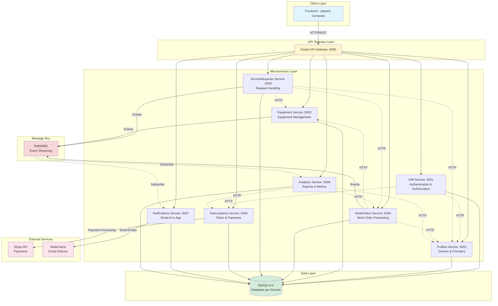

---

## Services Architecture

### 1. IAM Service (Identity & Access Management)

**Port:** 5001
**Database:** `ositopolar_iam`
**Responsibilities:**
- User authentication (login, register, 2FA)
- JWT token generation and validation
- Role-based access control (Owner, Provider, Admin)
- Password management

**Key Endpoints:**
- `POST /api/v1/authentication/sign-in` - User login
- `POST /api/v1/authentication/sign-up` - User registration
- `POST /api/v1/authentication/verify-2fa` - 2FA verification
- `GET /api/v1/users/{id}` - Get user details

**Dependencies:**
- Profiles Service (HTTP) - Create profile after registration
- Subscriptions Service (HTTP) - Validate subscription status

---

### 2. Profiles Service

**Port:** 5002
**Database:** `ositopolar_profiles`
**Responsibilities:**
- Manage Owner profiles (businesses)
- Manage Provider profiles (technicians, suppliers)
- Profile information (name, email, address)
- Balance tracking for Owners

**Key Endpoints:**
- `GET /api/v1/profiles` - List all profiles
- `GET /api/v1/profiles/{id}` - Get profile by ID
- `POST /api/v1/profiles` - Create profile
- `GET /api/v1/owners/{id}` - Get owner details
- `GET /api/v1/providers/{id}` - Get provider details

**Domain Models:**
- `Profile` (base) → `Owner`, `Provider`

---

### 3. Equipment Service

**Port:** 5003
**Database:** `ositopolar_equipment`
**Responsibilities:**
- Equipment catalog management
- Equipment status tracking (powered on/off)
- Temperature monitoring
- Energy consumption tracking
- Location management (GPS coordinates)

**Key Endpoints:**
- `GET /api/v1/equipment` - List all equipment
- `GET /api/v1/equipment/{id}` - Get equipment details
- `POST /api/v1/equipment` - Register new equipment
- `PUT /api/v1/equipment/{id}/status` - Update equipment status
- `GET /api/v1/equipment/owner/{ownerId}` - Get owner's equipment

**Domain Models:**
- `Equipment` - Main aggregate
- Value Objects: `Location`, `Temperature`, `EnergyConsumption`

---

### 4. ServiceRequests Service

**Port:** 5005
**Database:** `ositopolar_servicerequests`
**Responsibilities:**
- Receive service requests from Owners
- Match requests with Providers
- Request lifecycle management
- Uber-like marketplace functionality

**Key Endpoints:**
- `POST /api/v1/service-requests` - Create service request
- `GET /api/v1/service-requests/{id}` - Get request details
- `PUT /api/v1/service-requests/{id}/accept` - Provider accepts
- `GET /api/v1/service-requests/owner/{ownerId}` - Owner's requests

**Workflow:**
1. Owner creates request
2. System broadcasts to nearby Providers
3. Provider accepts request
4. Work Order is created automatically

**Events Published:**
- `ServiceRequestCreated`
- `ServiceRequestAccepted`
- `ServiceRequestCompleted`

---

### 5. WorkOrders Service

**Port:** 5004
**Database:** `ositopolar_workorders`
**Responsibilities:**
- Work order lifecycle management
- Technician assignment
- Scheduling and time slots
- Work completion tracking
- Cost calculation

**Key Endpoints:**
- `GET /api/v1/work-orders` - List work orders
- `GET /api/v1/work-orders/{id}` - Get work order details
- `PUT /api/v1/work-orders/{id}/assign` - Assign technician
- `PUT /api/v1/work-orders/{id}/complete` - Mark complete
- `POST /api/v1/work-orders/{id}/feedback` - Submit feedback

**Domain Models:**
- `WorkOrder` - Main aggregate
- Value Objects: `WorkOrderStatus`, `Priority`, `TimeSlot`

**Events Published:**
- `WorkOrderCreated`
- `WorkOrderAssigned`
- `WorkOrderCompleted`

---

### 6. Subscriptions Service

**Port:** 5006
**Database:** `ositopolar_subscriptions`
**Responsibilities:**
- Subscription plan management (Polar Bear, Snow Bear, Glacial Bear)
- Payment processing via Stripe
- Subscription lifecycle
- Service payment tracking

**Key Endpoints:**
- `GET /api/v1/subscriptions` - List available plans
- `GET /api/v1/subscriptions/{id}` - Get plan details
- `POST /api/v1/payments/create-session` - Create Stripe session
- `POST /api/v1/payments/webhook` - Stripe webhook handler
- `GET /api/v1/payments/user/{userId}` - User payment history

**Integration:**
- **Stripe API** - Payment processing
- Payment flow: Frontend → Create Session → Redirect to Stripe → Webhook confirms

**Domain Models:**
- `Subscription` - Plan details
- `Payment` - Payment records
- `ServicePayment` - Service-specific payments

---

### 7. Notifications Service

**Port:** 5007
**Database:** `ositopolar_notifications`
**Responsibilities:**
- Email notifications via MailerSend
- In-app notifications
- Template-based messaging
- Notification history

**Key Endpoints:**
- `POST /api/v1/notifications/email` - Send email
- `POST /api/v1/notifications/in-app` - Create in-app notification
- `GET /api/v1/notifications/user/{userId}` - Get user notifications
- `PUT /api/v1/notifications/{id}/read` - Mark as read

**Integration:**
- **MailerSend SMTP** - Email delivery
- HTML templates for professional emails

**Notification Types:**
- Welcome email (registration)
- Service request created
- Work order assigned
- Work order completed
- Payment confirmation

---

### 8. Analytics Service

**Port:** 5008
**Database:** `ositopolar_analytics`
**Responsibilities:**
- Business intelligence
- Usage metrics
- Performance reports
- Dashboard data aggregation

**Key Endpoints:**
- `GET /api/v1/analytics/dashboard/{ownerId}` - Owner dashboard
- `GET /api/v1/analytics/equipment-stats` - Equipment statistics
- `GET /api/v1/analytics/service-metrics` - Service performance
- `GET /api/v1/analytics/revenue-report` - Revenue analytics

**Data Sources:**
- Profiles Service - User data
- Equipment Service - Equipment metrics
- WorkOrders Service - Service completion rates
- Subscriptions Service - Revenue data

---

## Communication Patterns

### Synchronous Communication (HTTP)

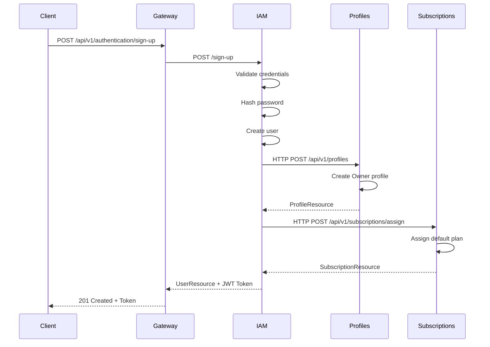

**When to use HTTP:**
- Real-time data required (user login, fetching profiles)
- Synchronous workflows (create profile → assign subscription)
- Request-response pattern
- Data validation needed immediately

**Anti-Corruption Layer (ACL):**
- Each service has HTTP Facades for calling other services
- Example: `ProfilesHttpFacade` in IAM service
- Transforms external responses to internal domain models

---

### Asynchronous Communication (RabbitMQ)

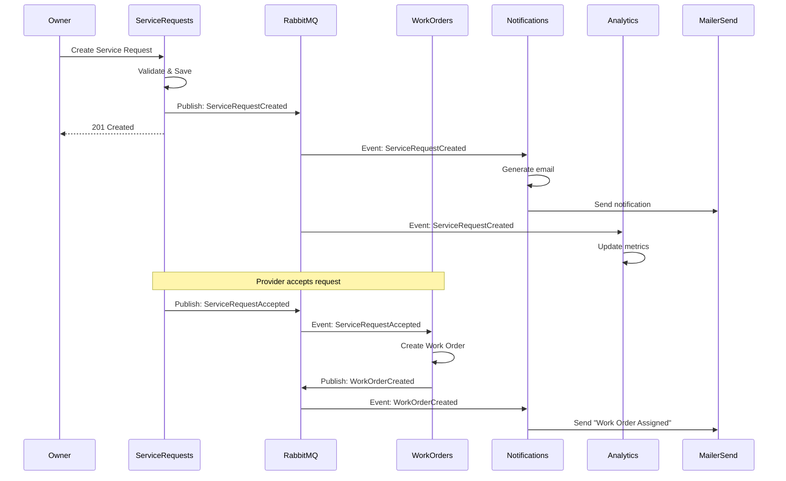

**When to use RabbitMQ:**
- Fire-and-forget operations (send notification)
- Event-driven workflows (service request → work order)
- Multiple subscribers need the same event
- Decoupling services (notifications, analytics)

**Event Types:**

| Event | Publisher | Subscribers | Purpose |
|-------|-----------|-------------|---------|
| `ServiceRequestCreated` | ServiceRequests | Notifications, Analytics | Notify stakeholders |
| `ServiceRequestAccepted` | ServiceRequests | WorkOrders, Notifications | Create work order |
| `WorkOrderCreated` | WorkOrders | Notifications, Analytics | Notify assignment |
| `WorkOrderCompleted` | WorkOrders | Notifications, Analytics, Subscriptions | Trigger billing |
| `EquipmentStatusChanged` | Equipment | Notifications, Analytics | Alert owners |

---

## Database Schemas (ERDs)

### IAM Service Database (`ositopolar_iam`)

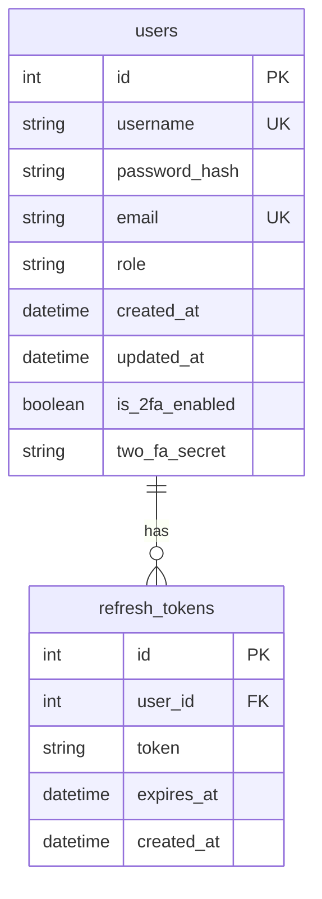

**Key Points:**
- Stores authentication credentials only
- Links to Profiles service via user_id
- JWT tokens generated, not stored
- 2FA support with TOTP secrets

---

### Profiles Service Database (`ositopolar_profiles`)

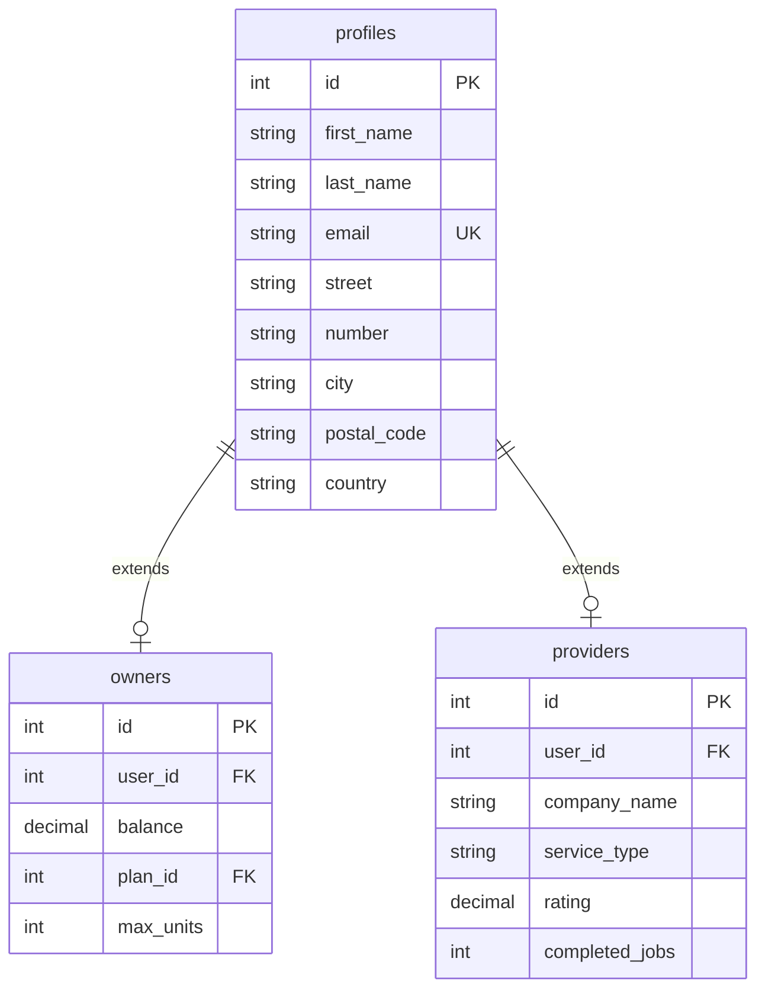

**Key Points:**
- Single Table Inheritance pattern
- Owners link to Subscriptions (plan_id)
- Providers track ratings and job history
- Balance tracking for billing

---

### Equipment Service Database (`ositopolar_equipment`)

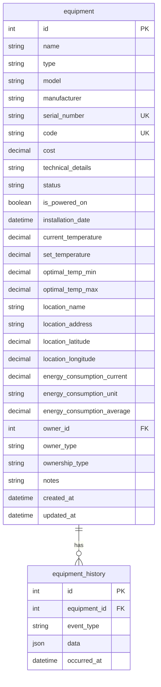

**Key Points:**
- Complete equipment lifecycle tracking
- GPS location tracking
- Temperature and energy monitoring
- Ownership tracking (owned/rented)

---

### ServiceRequests Service Database (`ositopolar_servicerequests`)

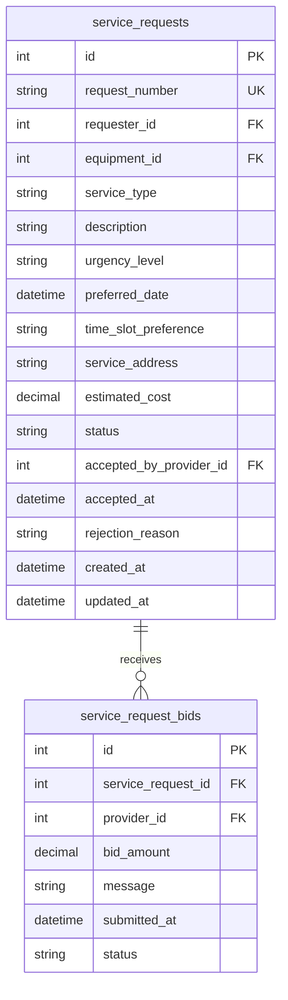

**Key Points:**
- Uber-like marketplace model
- Providers can bid on requests
- Status workflow: Pending → Accepted → InProgress → Completed
- Links to Equipment and Profiles services

---

### WorkOrders Service Database (`ositopolar_workorders`)

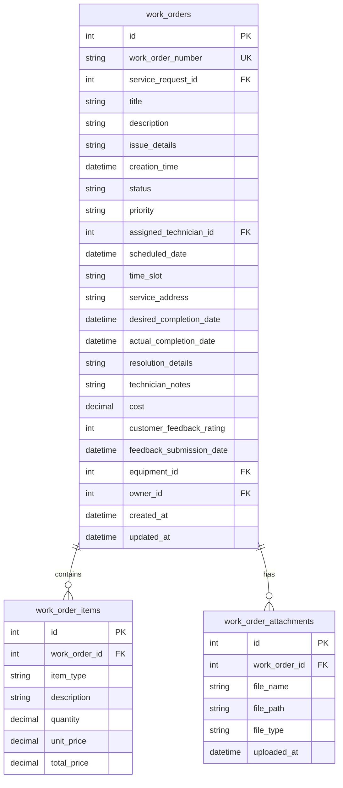

**Key Points:**
- Complete work order lifecycle
- Itemized billing (parts, labor)
- File attachments (photos, reports)
- Customer feedback and ratings

---

### Subscriptions Service Database (`ositopolar_subscriptions`)

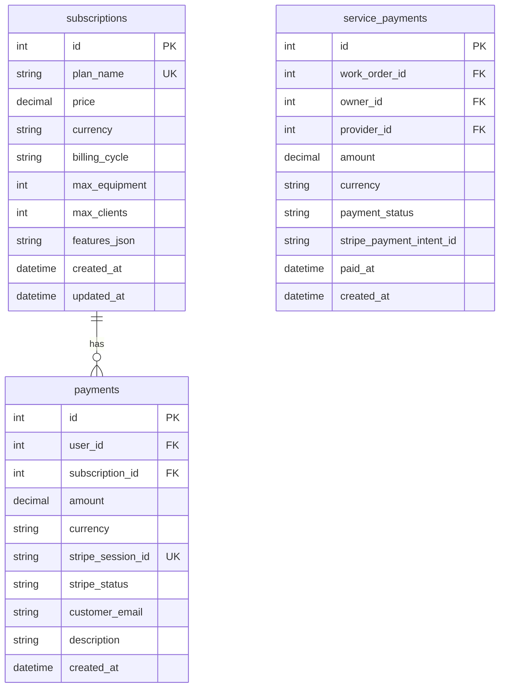

**Key Points:**
- Subscription plans (Polar Bear, Snow Bear, Glacial Bear)
- Payment tracking via Stripe
- Service payments separate from subscriptions
- Features stored as JSON for flexibility

---

### Notifications Service Database (`ositopolar_notifications`)

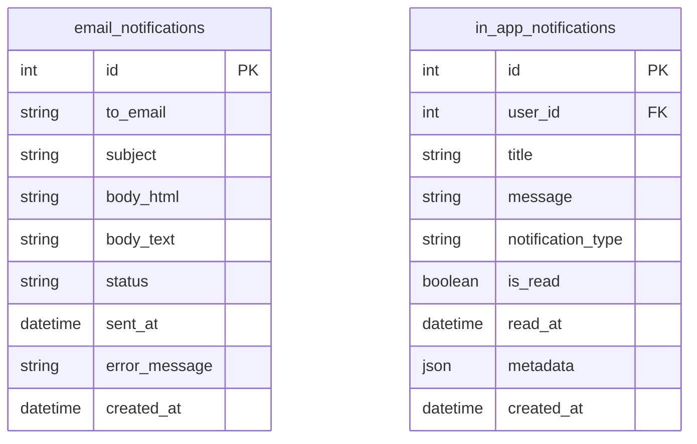

**Key Points:**
- Separate email and in-app notifications
- Template-based email generation
- Read/unread tracking for in-app
- Error logging for failed sends

---

### Analytics Service Database (`ositopolar_analytics`)

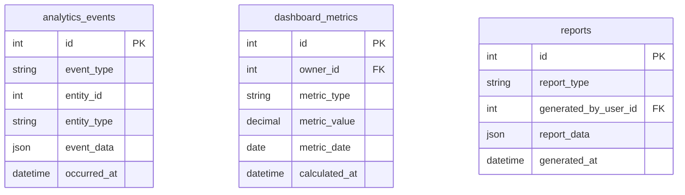

**Key Points:**
- Event sourcing for analytics
- Pre-calculated dashboard metrics
- Report generation and storage
- Time-series data for trends

---

## User Flows

### Complete Registration Flow

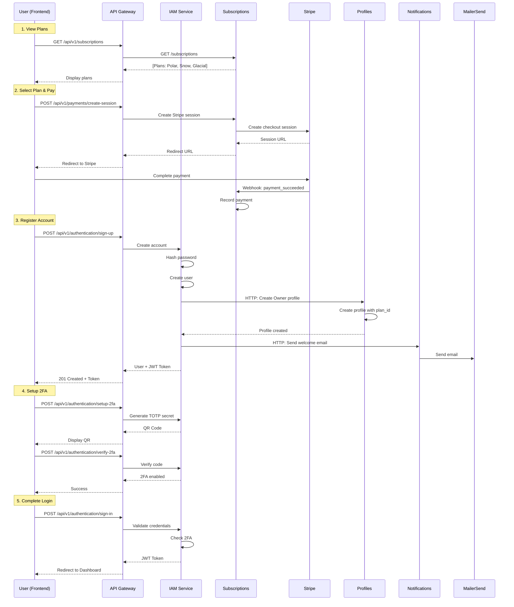

---

### Service Request to Work Order Flow

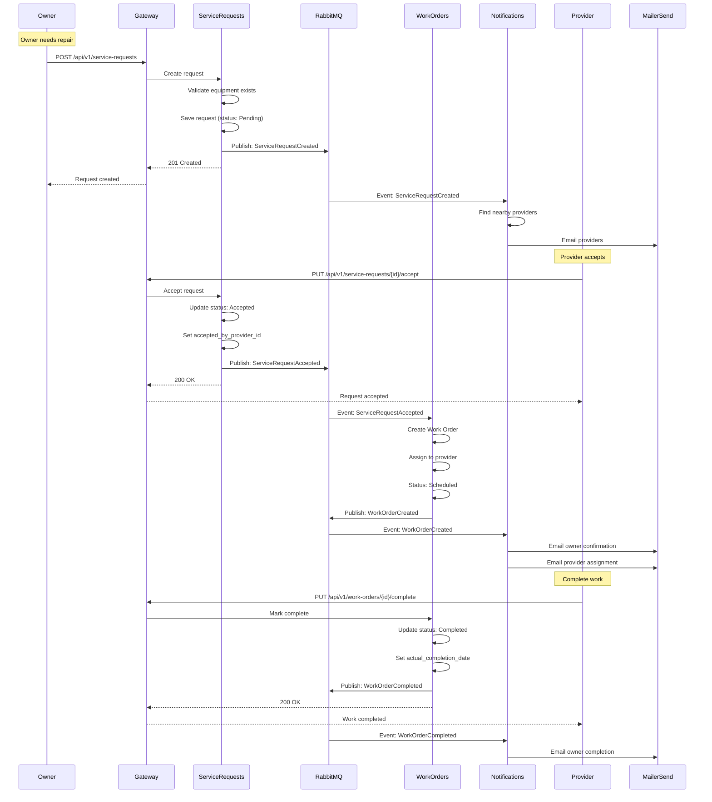

---

### Equipment Monitoring Flow

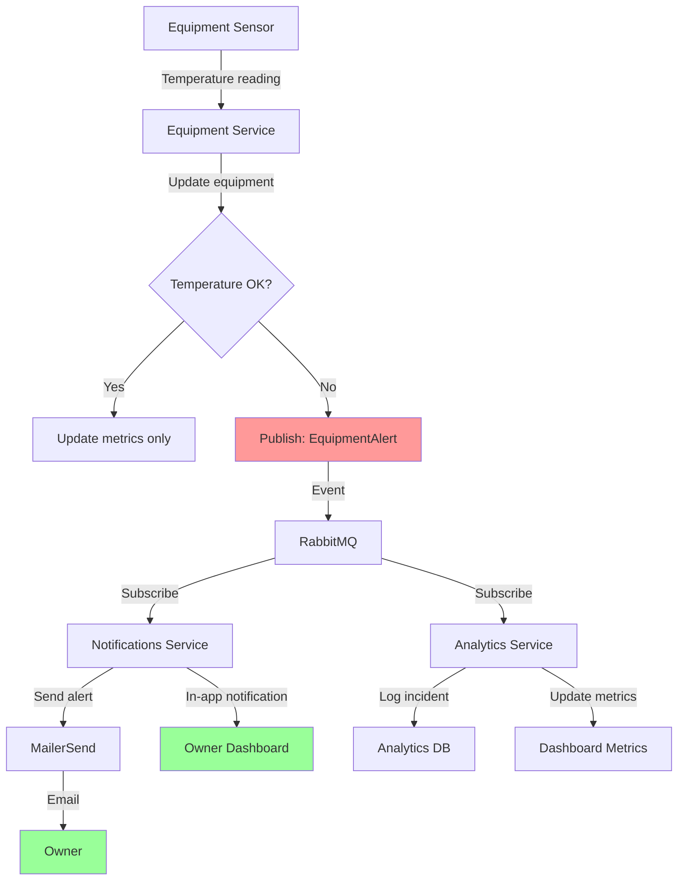

---

## RabbitMQ Implementation

### Architecture

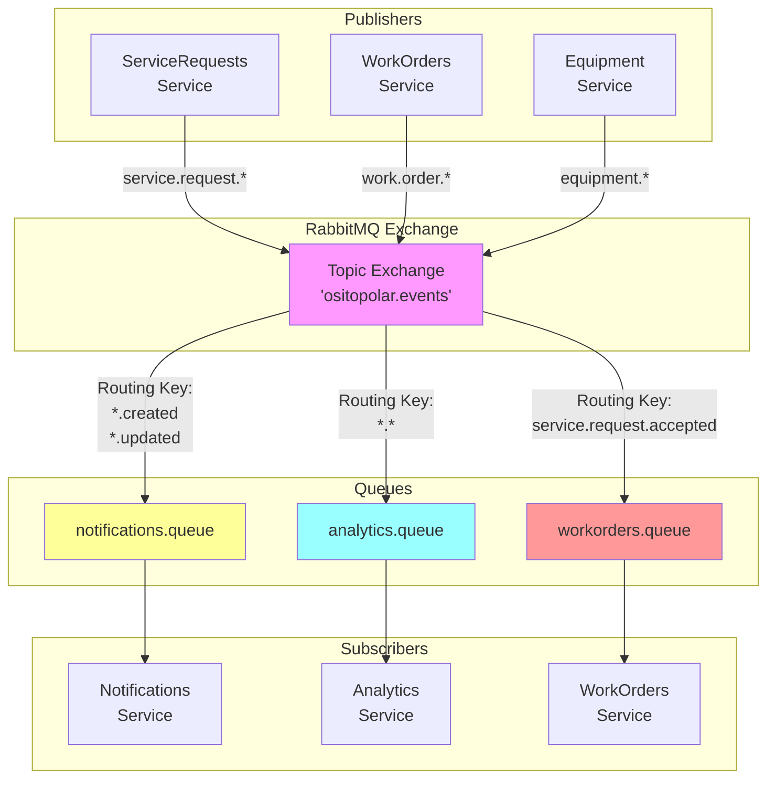

### Event Contracts

**ServiceRequestCreated Event:**
```json
{
  "eventId": "uuid",
  "eventType": "service.request.created",
  "timestamp": "2025-11-15T10:30:00Z",
  "data": {
    "serviceRequestId": 123,
    "requesterId": 45,
    "equipmentId": 67,
    "serviceType": "Maintenance",
    "urgency": "High",
    "location": {
      "latitude": -12.0464,
      "longitude": -77.0428
    }
  }
}
```

**WorkOrderCreated Event:**
```json
{
  "eventId": "uuid",
  "eventType": "work.order.created",
  "timestamp": "2025-11-15T11:00:00Z",
  "data": {
    "workOrderId": 456,
    "workOrderNumber": "WO-2025-001",
    "serviceRequestId": 123,
    "assignedTechnicianId": 78,
    "scheduledDate": "2025-11-16T14:00:00Z",
    "equipmentId": 67,
    "ownerId": 45
  }
}
```

### RabbitMQ Configuration

**Exchange:**
- Name: `ositopolar.events`
- Type: `Topic`
- Durable: `true`
- Auto-delete: `false`

**Routing Key Patterns:**
- `service.request.created`
- `service.request.accepted`
- `service.request.completed`
- `work.order.created`
- `work.order.assigned`
- `work.order.completed`
- `equipment.status.changed`
- `equipment.alert.temperature`

**Queues:**

| Queue Name | Bindings | Consumer |
|------------|----------|----------|
| `notifications.queue` | `*.created`, `*.completed`, `*.alert.*` | Notifications Service |
| `analytics.queue` | `*.*` (all events) | Analytics Service |
| `workorders.queue` | `service.request.accepted` | WorkOrders Service |

### Implementation Steps

1. **Install RabbitMQ** (Docker):
```yaml
rabbitmq:
  image: rabbitmq:3-management
  ports:
    - "5672:5672"
    - "15672:15672"
  environment:
    RABBITMQ_DEFAULT_USER: ositopolar
    RABBITMQ_DEFAULT_PASS: ${RABBITMQ_PASSWORD}
```

2. **Add NuGet Package** to each service:
```bash
dotnet add package RabbitMQ.Client
```

3. **Create Event Bus Interface**:
```csharp
public interface IEventBus
{
    void Publish<T>(T @event) where T : IntegrationEvent;
    void Subscribe<T, TH>()
        where T : IntegrationEvent
        where TH : IIntegrationEventHandler<T>;
}
```

4. **Implement Publisher** (ServiceRequests):
```csharp
public class ServiceRequestCommandService
{
    private readonly IEventBus _eventBus;

    public async Task CreateServiceRequest(...)
    {
        var serviceRequest = new ServiceRequest(...);
        await _repository.AddAsync(serviceRequest);
        await _unitOfWork.CompleteAsync();

        // Publish event
        var @event = new ServiceRequestCreatedEvent
        {
            ServiceRequestId = serviceRequest.Id,
            RequesterId = serviceRequest.RequesterId,
            EquipmentId = serviceRequest.EquipmentId
        };

        _eventBus.Publish(@event);
    }
}
```

5. **Implement Subscriber** (Notifications):
```csharp
public class ServiceRequestCreatedHandler
    : IIntegrationEventHandler<ServiceRequestCreatedEvent>
{
    public async Task Handle(ServiceRequestCreatedEvent @event)
    {
        // Send notification email
        await _emailService.SendServiceRequestNotification(@event);
    }
}
```

---

## Domain Model Relationships

### Core Domain Models

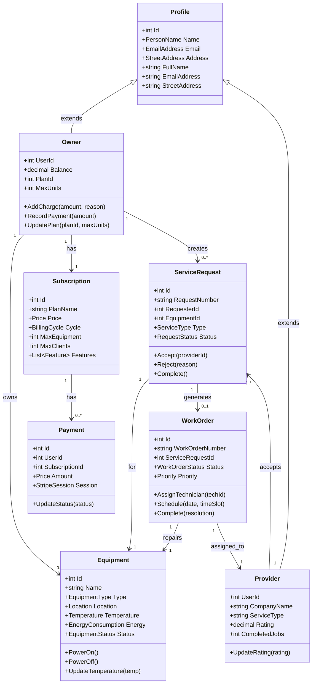

### Value Objects

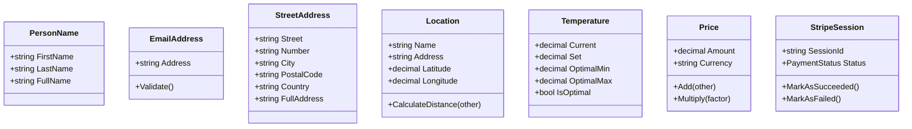

---

## Deployment & Orchestration

### Docker Compose Structure

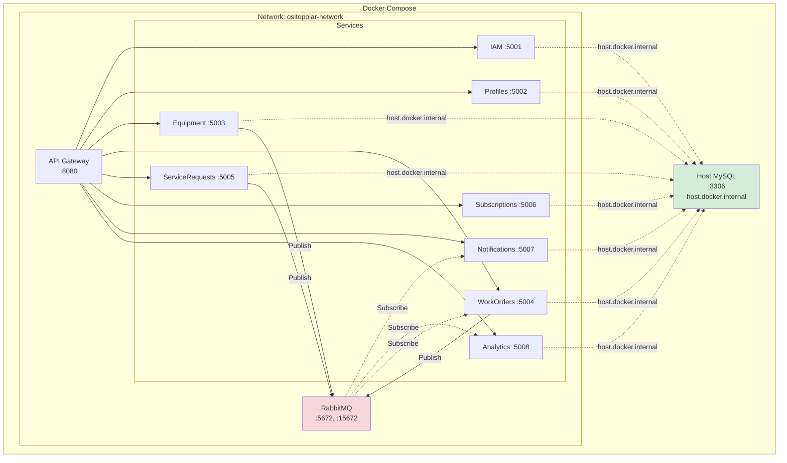

### Deployment Commands

```bash
# Start all services
cd C:\Users\josep\RiderProjects\Microservicios\OsitoPolar.Infrastructure
docker-compose up -d --build

# View logs
docker-compose logs -f

# View specific service logs
docker logs ositopolar-iam -f

# Check service health
docker ps

# Stop all services
docker-compose down

# Restart specific service
docker-compose restart iam-service

# View RabbitMQ Management UI
# Open browser: http://localhost:15672
# Username: ositopolar / Password: from .env
```

### Health Checks

Each service implements health check endpoints:

```
GET /health
```

**Response:**
```json
{
  "status": "Healthy",
  "checks": {
    "database": "Connected",
    "rabbitmq": "Connected"
  },
  "timestamp": "2025-11-15T10:30:00Z"
}
```

---

## Environment Variables

### Required Configuration

Create `.env` file in Infrastructure directory:

```env
# Database
MYSQL_ROOT_PASSWORD=your_password

# JWT
JWT_SECRET=your_jwt_secret_key_min_32_chars

# Stripe
STRIPE_SECRET_KEY=sk_test_...
STRIPE_PUBLISHABLE_KEY=pk_test_...
STRIPE_WEBHOOK_SECRET=whsec_...

# MailerSend
MAILERSEND_USERNAME=MS_...
MAILERSEND_PASSWORD=your_password
MAILERSEND_FROM_EMAIL=noreply@ositopolar.com

# RabbitMQ (future)
RABBITMQ_PASSWORD=your_rabbitmq_password
```

---

## API Gateway Routes (Ocelot)

### Route Configuration

```json
{
  "Routes": [
    {
      "DownstreamPathTemplate": "/api/v1/{everything}",
      "DownstreamScheme": "http",
      "DownstreamHostAndPorts": [
        { "Host": "iam-service", "Port": 8080 }
      ],
      "UpstreamPathTemplate": "/api/v1/authentication/{everything}",
      "UpstreamHttpMethod": [ "GET", "POST", "PUT", "DELETE" ]
    },
    {
      "DownstreamPathTemplate": "/api/v1/{everything}",
      "DownstreamScheme": "http",
      "DownstreamHostAndPorts": [
        { "Host": "profiles-service", "Port": 8080 }
      ],
      "UpstreamPathTemplate": "/api/v1/profiles/{everything}",
      "UpstreamHttpMethod": [ "GET", "POST", "PUT", "DELETE" ]
    }
  ],
  "GlobalConfiguration": {
    "BaseUrl": "http://localhost:8080"
  }
}
```

---

## Monitoring & Observability

### Metrics to Track

**Per Service:**
- Request count
- Response time (p50, p95, p99)
- Error rate
- Database connection pool usage

**RabbitMQ:**
- Messages published/consumed
- Queue depth
- Consumer lag
- Failed messages

**Infrastructure:**
- Container CPU/Memory usage
- Network I/O
- Disk usage

### Logging Strategy

**Log Levels:**
- `DEBUG` - Development only
- `INFO` - Service startup, major operations
- `WARN` - Recoverable errors, deprecated features
- `ERROR` - Unhandled exceptions, critical failures

**Structured Logging Format:**
```json
{
  "timestamp": "2025-11-15T10:30:00Z",
  "level": "INFO",
  "service": "iam-service",
  "traceId": "abc123",
  "message": "User logged in successfully",
  "userId": 123,
  "ipAddress": "192.168.1.1"
}
```

---

## Security Considerations

1. **JWT Token Validation** - All services validate tokens via IAM
2. **HTTPS** - All external communication encrypted
3. **SQL Injection** - Parameterized queries, EF Core protection
4. **CORS** - Configured per service, restrictive in production
5. **Rate Limiting** - API Gateway implements rate limits
6. **Secrets Management** - Environment variables, never in code
7. **Database Access** - Principle of least privilege
8. **Service-to-Service Auth** - API keys for internal communication

---

## Next Steps

### Phase 1: Current State ✅
- [x] Docker infrastructure running
- [x] 8 microservices operational
- [x] MySQL databases per service
- [x] HTTP communication working
- [x] Stripe integration configured
- [x] MailerSend integration configured

### Phase 2: RabbitMQ Implementation (Next)
- [ ] Add RabbitMQ to docker-compose
- [ ] Implement Event Bus abstraction
- [ ] Add event publishers to ServiceRequests, WorkOrders
- [ ] Add event subscribers to Notifications, Analytics
- [ ] Test async workflows

### Phase 3: API Gateway Enhancement
- [ ] Configure Ocelot routes
- [ ] Add authentication middleware
- [ ] Implement rate limiting
- [ ] Add request/response logging

### Phase 4: Production Readiness
- [ ] Add health checks to all services
- [ ] Implement distributed tracing (OpenTelemetry)
- [ ] Add monitoring (Prometheus + Grafana)
- [ ] Configure auto-scaling
- [ ] Add backup strategy for databases

---

## Troubleshooting

### Common Issues

**Services can't connect to MySQL:**
```bash
# Check if MySQL is running
netstat -an | findstr 3306

# Test connection from service
docker exec ositopolar-iam mysql -h host.docker.internal -u root -p
```

**RabbitMQ connection failed:**
```bash
# Check RabbitMQ is running
docker logs ositopolar-rabbitmq

# Access management UI
http://localhost:15672
```

**Service crashes on startup:**
```bash
# View service logs
docker logs ositopolar-[service-name]

# Check environment variables
docker exec ositopolar-[service-name] env
```

---

## Contact & Support

For questions or issues:
- Check logs: `docker-compose logs -f`
- Review this documentation
- Check service health: `http://localhost:[port]/health`
- View API docs: `http://localhost:[port]/swagger`

---

**Generated:** 2025-11-15
**Version:** 1.0
**Status:** Production Ready (Phase 1 Complete)
